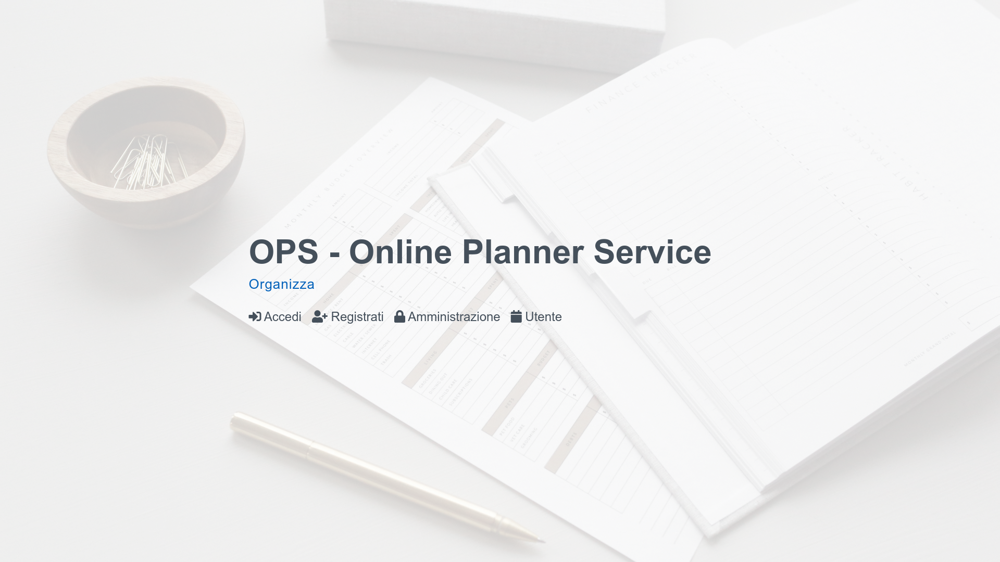
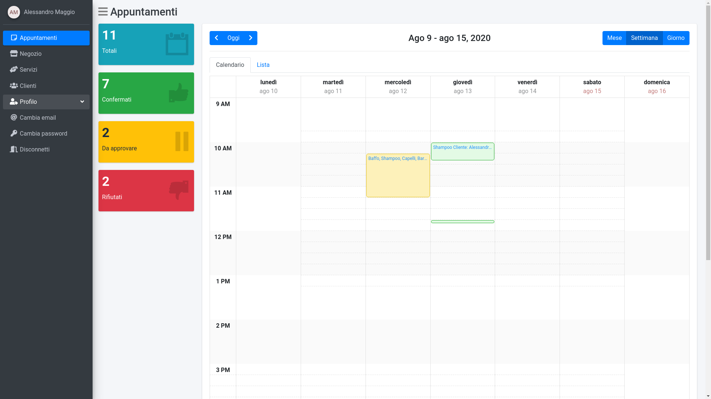
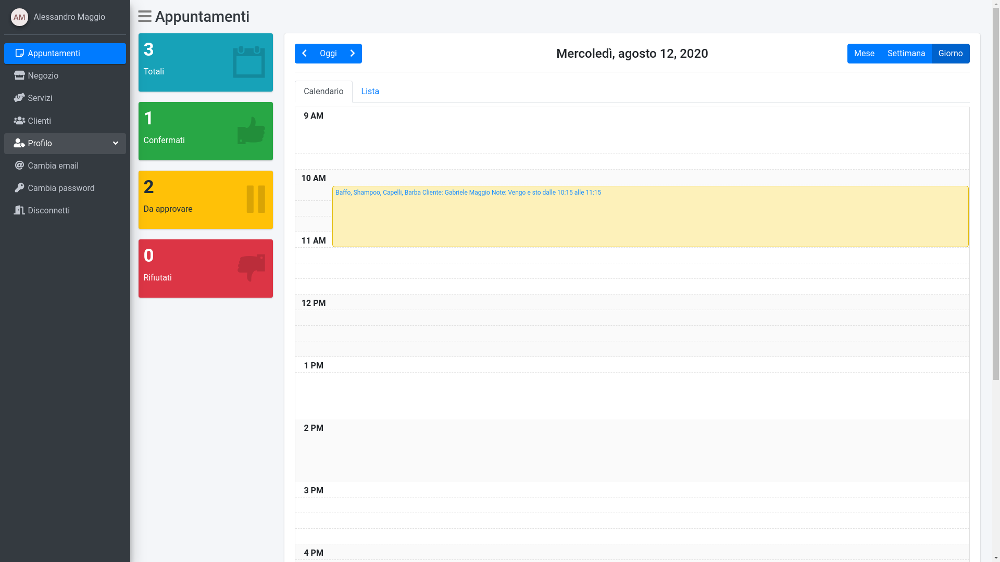
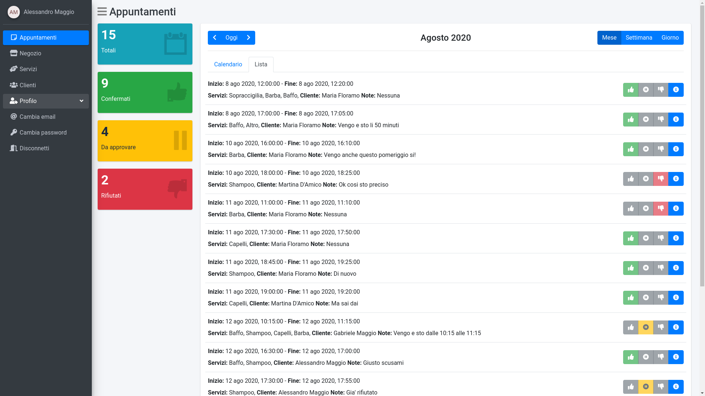
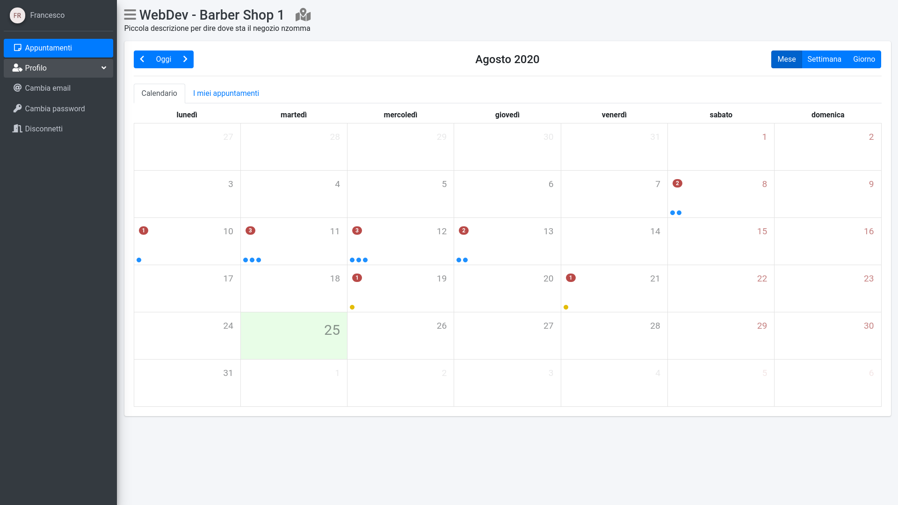

# :date: OPS - Online Planner Service

### Backend

**[Important!] Make sure to have a mysql database property setup and a empty database**

1. `cd backend`
2. Create the virtualenv: `virtualenv -p python3 env`
3. Activate the venv: `source env/bin/activate`
4. Install all requirements: `pip install -r requirements.txt`

**Settings**
1. Generate the salt for password encryption
```python
python
>>> import bcrypt
>>> bcrypt.gensalt(10)
b'$2b$10$5Ij/lH/3/NcJSPMkf.AKPe'  # Example ...
```
2. Copy the .dist setting to settings.json `cp settings.json.dist settings.json`
3. Edit the settings.json file like this example:
```js
{
	"EMAIL": {
		"SMTP": "smtp.gmail.com",
		"PORT": 587,
		"EMAIL": "youbestemail@gmail.com",
		"PASSWORD": "youbestpassword (i hope)"
	},
    	"SALT": "$2b$10$5Ij/lH/3/NcJSPMkf.AKPe",
    	/* Copy only the string and not the bytes char (b) */
    	"JWT_SECRET_KEY": "lxVYbvu7ZwFNlt1gkx9K",
    	/* You can generate a random password here: https://passwordsgenerator.net */
	"DATABASE": {
		"NAME": "ops",
		"USER": "root",
		"PASSWORD": "root",
		"HOST": "127.0.0.1",
		"PORT": 3306
	}
}
```
4. Start the service (with venv activate): `python main.py`


### Frontend

1. Navigate to folder: `cd frontend`
2. Install all node_mdoules: `npm i`
3. If you are out of localhost edit the *API_ENDPOINT* variable located at: `src/app/common/constants.ts`
4. Start the service: `ng service --open`

## Screenshot and description
### Common area




### Admin

Here the admin can set up a general info for business activity and set the timetable of the store.


___

In this page the admin can create/edit/delete the services offered by the business.\
Each service must have a name and can have description, duration and price.


___

The core of the project. The calendar where the admin can see all reservation and create a new one or edit a existing reservation.\
With the edit option obviously the admin can approve or reject the reservation.






___

In this page the admin can search for a customer, see the related info and the reservation history.


___

### User
The user dashboard is a small version of plans page for admin, obviously with less privileges.


